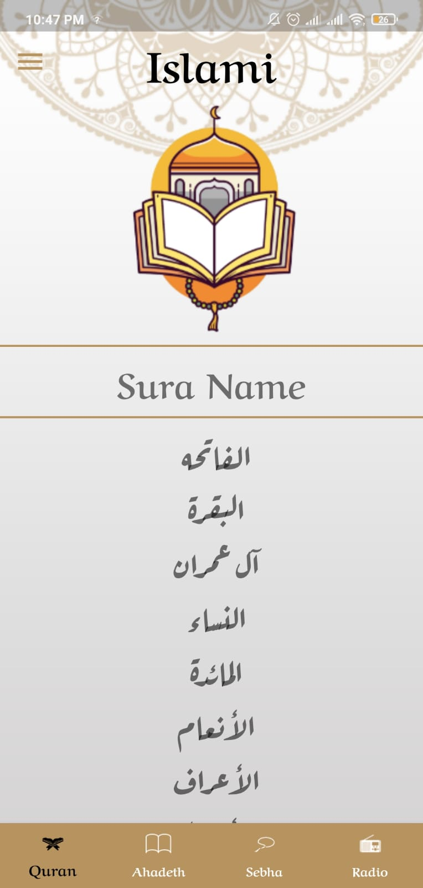
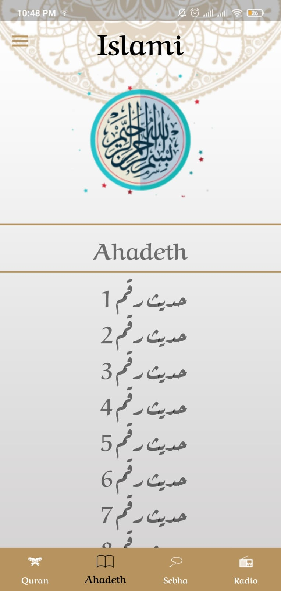
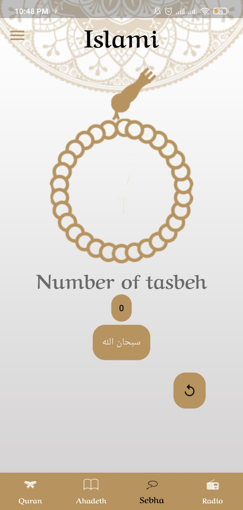

# Islami App 🕌
A simple Islamic application designed to help Muslims easily practice their daily worship.
The app is built using Flutter and offers a clean design with a smooth user experience.

## Features ✨
Read the Holy Qur’an 📖

Listen to verses with clear audio 🎧

A dedicated section for authentic Hadiths 📜

Daily Azkar, including morning and evening supplications 💬

Fully Arabic user interface 🌐

## Technologies Used 🛠️
Flutter – For building the user interface

Dart – The programming language used

Local Assets (Audio & Text) – Allows offline access to content

Provider / Cubit – For state management (depending on the one used)


## 🖼️ Screenshots


## Quran



## Ahadith



## Azkar



## Installation 🚀

1. Clone the repository:
   ```bash
   git clone https://github.com/mohmdadl/weather_app.git

## Contributing 🤝
*Feel free to submit pull requests to improve the project.*
